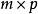
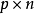
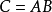
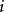
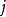

# C# TensorFlow 2 入门教程

# 一、机器学习基础

# 二、TensorFlow.NET API

## 1. TensorFlow.NET介绍

[TensorFlow.NET](<https://github.com/SciSharp/TensorFlow.NET>) (TF.NET) 是 [SciSharp STACK](<https://github.com/SciSharp>)   开源社区团队的贡献，它为[TensorFlow](https://www.tensorflow.org/)提供了.NET Standard binding，旨在以C＃实现完整的Tensorflow API，允许.NET开发人员使用跨平台的.NET Standard框架开发、训练和部署机器学习模型。TF.NET的使命是打造一个完全属于.NET开发者自己的机器学习平台，**特别对于C#开发人员来说，是一个“0”学习成本的机器学习平台**，该平台集成了大量API和底层封装，**力图使TensorFlow的Python代码风格和编程习惯可以无缝移植到.NET平台**，下图是同样TF任务的Python实现和C#实现的语法相似度对比，从中读者基本可以略窥一二。


SciSharp STACK的机器学习工具库和微软官方的库最大的区别是：里面所有库的语法都最大限度的按照python生态的习惯。有了SciSharp, 相当于有了typed-python (强类型python)，这样做的目的，也是为了.NET开发者花最小的成本去学习并运用上机器学习。SciSharp STACK 目前包含几个流行项目: BotSharp(AI机器人平台框架)，NumSharp(数值计算库)，TensorFlow.NET (深度学习库)，Pandas.NET (数据处理库)，SharpCV（图形图像处理库），可以完全脱离Python环境使用，**目前已经被微软ML.NET官方的底层算法集成，并被谷歌写入TensorFlow官网教程推荐给全球开发者。**

- **SciSharp 产品结构**

  

- **微软 ML.NET底层集成算法**

  

- **谷歌官方推荐.NET开发者使用**

  URL: https://www.tensorflow.org/versions/r2.0/api_docs

  


## 2. 数据类型

## 3. 张量类型

## 4. 数学运算

## 5. Eager Mode

### 5.1 Eager模式说明

Eager Mode 也叫做动态图模式，是TensorFlow 1.4之后版本中最重要的新特征之一，也是TensorFlow 2.0的主流写法。Eager模式是一个命令式（imperative）、运行定义式的编程形式，操作一旦从程序中调用便立即得以执行，而不再像之前那样，生成一个Tensor，通过sess.run()才能拿到值，这样使得TensorFlow的入门使用、研究和开发就更为直观。

TensorFlow 2种的动态图是优先模式，为默认开启状态，在计算时可以同时获得计算图和数值运算的结果，可以在调试的过程中实时打印出数据。


### 5.2 Eager模式比较

下面通过TF.NET的代码对比，方便读者直观了解TensorFlow 1.4之前的静态图和 TensorFlow 2 的Eager模式的差异点。

首先，我们在TensorFlow 1.x下实现 2.0 + 3.0 的简单加法运算。

第一步，创建计算图。

创建计算图的过程仅仅是使用各变量名创建出 “ a + b ” 加法的计算规则，记录下该公式的计算步骤，并没有传入具体的值和执行具体的计算过程。

第二步，赋值并运行计算图。

通过开启会话Session，运行公式(静态图)中的节点 “ c ”，并复制 a = 2.0 , b = 3.0 来获得 c 的数值计算结果。

完整代码如下：

```c#
using System;
using Tensorflow;
using static Tensorflow.Binding;

namespace TF_Test
{
    class Program
    {
        //Basic Operation 2.0 + 3.0 with TensorFlow.NET 1.x
        static void Main(string[] args)
        {
            // 1.创建计算图 
            // 创建2个输入端子，指定类型和名字 
            var a = tf.placeholder(tf.float32, name: "variable_a");
            var b = tf.placeholder(tf.float32, name: "variable_b");
            // 创建输出端子的运算操作，并命名 
            var c = tf.add(a, b, name: "variable_c");

            // 2. 赋值并运行计算图
            // 初始化运行环境，开启会话Session
            var init = tf.global_variables_initializer();
            using (var sess = tf.Session())
            {
                sess.run(init);//运行初始化操作，完成初始化
                //给输入端子赋值
                var feed_dict = new FeedItem[]
                {
                    new FeedItem(a, 2),
                    new FeedItem(b, 3)
                };
                //运行输出端子
                var c_numpy = sess.run(c, feed_dict);
                //运行完输出端子，得到数值类型的 c_numpy
                Console.WriteLine($"Addition with variables: {c_numpy}");
            }

            Console.Read();
        }
    }
}
```

可以看到，在 TensorFlow.NET 1.x 中完成简单的 2.0 + 3.0 的过程十分繁琐，后面搭建复制的神经网络模型亦是如此，这种先创建静态计算图再赋值执行的方式叫做符号式编程。

接下来，我们来看下在 TensorFlow.NET 2.0 中完成 2.0 + 3.0 运算的代码：

* TF.NET 也支持 使用 ( + , * , ... ) 等算术符直接进行运算

```c#
using System;
using Tensorflow;
using static Tensorflow.Binding;

namespace TF_Test
{
    class Program
    {
        //Basic Operation 2.0 + 3.0 with TensorFlow.NET 2
        static void Main(string[] args)
        {
            // 创建输入张量
            var a = tf.constant(2);
            var b = tf.constant(3);

            // 直接打印结果【也支持(+,*,...)等算术符直接进行运算】
            var c = tf.add(a, b);
            print($"Addition with variables: {c.numpy()}");
        }
    }
}
```

上述 2 种编程方式，都可以得到正确的结果 "Addition with variables: 5" 如下：


这种运算时同时创建计算图和计算结果的方式叫做命令式编程，TensorFlow 2 和 PyTorch 都是采用这种模式开发的，这种方式开发效率高，调试方便，所见即所得，但是运行效率可能不如静态图模式方便（后面我们会介绍如何使用 tf.function 来提高运行效率）。

### 5.3 Eager模式数值运算

现在，我们来演示 Eager Mode 下常见的 “ 加、减、乘、除 ” 数值运算，这串代码是通过 tf 函数 “ add、subtract、multiply、divide ”进行直接的数值运算，也可以通过运算符 “ +、-、*、/ ” 进行相同的数值操作。

常用的运算操作代码如下：

```c#
using System;
using Tensorflow;
using static Tensorflow.Binding;

namespace TF_Test
{
    class Program
    {
        //Basic Operation add,subtract,multiply,divide
        static void Main(string[] args)
        {
            // 定义Tensor常量类型的数值
            var a = tf.constant(2);
            var b = tf.constant(3);

            // 张量运算操作
            var add = tf.add(a, b);
            var sub = tf.subtract(a, b);
            var mul = tf.multiply(a, b);
            var div = tf.divide(a, b);

            // 访问运算结果并输出
            print("add =", add.numpy());//加
            print("sub =", sub.numpy());//减
            print("mul =", mul.numpy());//乘
            print("div =", div.numpy());//除    
        }
    }
}
```

代码的执行结果如下，我们可以看到 TF.NET 正确地执行并输出了运算后的数值：


### 5.4 Eager模式张量降维运算

接下来，我们来演示 Eager Mode 下的 张量降维运算。

首先是模型训练过程中计算 Loss 时常用的 reduce_mean 和 reduce_sum 函数，从函数名称上可以看出来，这个函数有2个功能，降维和求平均(求和)。我们来分别讲解2个函数的定义：

tf.reduce_mean()：用于计算张量 tensor 沿着指定的数轴（tensor 的某一维度）上的平均值，主要用作降维或者计算 tensor（图像）的平均值。

```c#
public Tensor reduce_mean(
    Tensor[] input_tensors, 
    int? axis = null, 
    bool keepdims = false, 
    string name = null)
```

参数：

- input_tensors： 输入的待降维的 tensor
- axis： 指定的轴，如果不指定，则计算所有元素的均值
- keepdims：是否降维度，默认 false。设置为 true，输出的结果保持输入tensor 的形状，设置为 false，输出结果会降低维度
- name： 操作的名称

tf.reduce_sum()：用于计算张量 tensor 沿着指定的数轴（tensor 的某一维度）上的累加和，主要用作降维或者计算 tensor（图像）的累加和。

```c#
public Tensor reduce_sum(
    Tensor[] input_tensors, 
    int? axis = null, 
    bool keepdims = false, 
    string name = null)
```

参数：

- input_tensors： 输入的待降维的 tensor
- axis： 指定的轴，如果不指定，则计算所有元素的累加和
- keepdims：是否降维度，默认 false。设置为 true，输出的结果保持输入 tensor 的形状，设置为 false，输出结果会降低维度
- name： 操作的名称

除此之外，还有一些常用的函数，例如 reduce_any、reduce_all、reduce_prod、reduce_max、reduce_min ，这些都实现了降维和统计运算的功能。

这些函数的参数列表也是基本相同的，其中第一项 input_tensors 为待运算和待降维的输入张量；第二项 axis 为降维的轴，即需要对其进行降维的轴；第三项 keepdims 设定输出张量的维度是否保持和输入张量一致，一般选默认 false 以实现降维的效果，如果有特殊需要输出维度保持不变的情况，可以设定为 true ；最后一项 name 定义操作的名称。

上面的参数列表中，第二项 axis 可能需要读者进行一下理解，特别是维度超过2维的情况。当 axis = 0 时，是纵向对矩阵求和，原来矩阵有几列最后就得到几个值；相似地，当 axis = 1 时，是横向对矩阵求和，原来矩阵有几行最后就得到几个值；当省略 axis 参数时，默认对矩阵所有元素进行求和，最后得到一个值。如下图所示：


 对于一个多维的 array，最外层的括号里的元素的 axis 为 0，然后每减一层括号，axis 就加 1，直到最后的元素为单个数字。我们来按照3维的情况进行举例说明，例如 matrix = [[[1,2],[3,4]], [[5,6],[7,8]]]：

- axis=0时，所包含的元素有：[[1, 2],[3, 4]]、[[5, 6],[7, 8]]
- axis=1时，所包含的元素有：[1, 2]、[3, 4]、[5, 6]、[7, 8]
- axis=2时，所包含的的元素有：1、2、3、4、5、6、7、8

当 axis = 0，reduce_sum() 得到的结果应为 [[6 , 8], [10 , 12]]，即把两个矩阵对应位置元素相加；当 axis = 1，reduce_sum() 得到的结果应为 [[ 4 , 6], [12 , 14]]，即把数组对应元素相加。一句话总结就是对哪一维操作，计算完后外面的括号就去掉，相当于降维。

TF.NET 的 tf.reduce_mean 和 tf.reduce_sum 代码测试如下：

```c#
using NumSharp;
using System;
using Tensorflow;
using static Tensorflow.Binding;

namespace TF_Test
{
    class Program
    {
        //Basic Operation tf.reduce_mean,tf.reduce_sum
        static void Main(string[] args)
        {
            // 定义Tensor常量
            var a = tf.constant(2);
            var b = tf.constant(3);
            var c = tf.constant(5);

            // tf.reduce_mean 和 tf.reduce_sum 运算
            var mean = tf.reduce_mean(new[] { a, b, c });
            var sum = tf.reduce_sum(new[] { a, b, c });

            // 访问运算结果并输出
            print("mean =", mean.numpy());
            print("sum =", sum.numpy());
        }
    }
}
```

运行后，程序正确地输出了张量平均值与累加和的结果 3 和 10，如下所示：


### 5.5 Eager模式矩阵运算

最后，简单介绍一下Eager模式的矩阵运算，矩阵运算有 tf.diag()、tf.matmul()、tf.batch_matmul()等，这里主要说明下矩阵乘法 tf.matmul()。

矩阵乘法的运算公式是这样的，设 **A** 为  的矩阵， **B** 为  的矩阵，那么称  的矩阵 **C** 为矩阵 **A** 与 **B** 的乘积，记作  ，其中矩阵 **C **中的第  行第  列元素可以表示为：


如下所示：


简单地说，矩阵乘法就是矩阵A和矩阵B的行列交叉相乘并累加求和，求和的结果生成新的矩阵，如下图所示：


下面我们通过实际案例来说明，2个二维矩阵的乘法，我们先看一下公式：


然后我们通过代码实现一下2个二维矩阵的乘法，代码如下：

```c#
using NumSharp;
using System;
using Tensorflow;
using static Tensorflow.Binding;

namespace TF.Test
{
    class Program
    {
        static void Main(string[] args)
        {
            // 矩阵乘法
            var matrix1 = tf.constant(np.array(new float[,] { { 1, 2 }, { 3, 4 } }));
            var matrix2 = tf.constant(np.array(new float[,] { { 5, 6 }, { 7, 8 } }));
            var product = tf.matmul(matrix1, matrix2);
            // 类型转换：tensor转换成numpy
            print("product =", product.numpy());
        }
    }
}
```

通过代码调试我们可以看到 product 是一个 sharp 为[2,2] 的张量，各矩阵的形状如下：


程序运行后正确地输出了矩阵相乘的结果转换成的 numpy 类型数值为 [19, 22, 43, 50]：


## 6. 常量、变量、占位符和节点操作

## 7. 计算图和会话

## 8. 数据流队列

## 9. 优化、梯度和反向传播

## 10. Train相关

## 11. 动态图模式

## 12. Tensorboard和Summary类

## 13. CheckPoint操作

## 14. 神经网络相关


# 三、工业应用与案例

## 1. TensorFlow.NET 初探

### 1.1 CPU 和 GPU 环境搭建及安装

#### 1.1.1 环境配置

写在前面：本章节的案例均基于TF.NET 0.20，对应TensorFlow 2.0版本

建议的系统环境配置如下：

- 操作系统：Windows 7 & 10  64bit
- .NET 框架：使用.NET Framework 4.7.2及以上，或者使用.NET CORE 2.2及以上
- VisualStudio版本：建议使用 Microsoft Visual Studio 2019 版本
- 如果使用C#语言：使用 C# 7.3 及以上的版本

#### 1.1.2 CPU环境下的TF.NET使用（ToDo：图文待更新至TF.NET 0.20版本）

CPU 硬件配置：

由于预编译版本的编译选项中选定了支持的处理器参数，因此需要你的主机CPU架构支持AVX/SSE加速指令，如何判断主机的CPU是否支持该指令集，可以访问CPU官网查询，或者使用一些CPU检测工具，例如CPUID的CPU-Z程序，检测结果如下，指令集显示支持SSE/AVX：


如果你的处理器是INTEL的，下述表格是目前不支持的CPU清单：

|         CPU系列         | 包含或低于该型号的CPU不支持 |
| :---------------------: | :-------------------------: |
|         Core i7         |         Core i7-970         |
| Core i7 Extreme Edition |        Core i7-990X         |
|    Xeon 3500 series     |         Xeon W3580          |
|    Xeon 3600 series     |         Xeon W3690          |
|    Xeon 5500 series     |         Xeon W5590          |
|    Xeon 5600 series     |         Xeon X5698          |

**第一步，新建项目**

打开VS2019，新建控制台应用(.NET Framework)


数据项目名，选择框架 .NET Framework 4.7.2（或者更高，或者使用.NET CORE 2.2及以上）


项目Properties 目标平台 选择  X64 


**第二步，安装和引用TF.NET**

通过NuGet安装TF.NET：

打开 工具 -> NuGet包管理器 -> 程序包管理控制台，安装 tensorflow C# binding

在控制台输入 Install-Package TensorFlow.NET 进行安装


安装完成后，继续安装 tensorflow binary CPU版本，在控制台输入 Install-Package SciSharp.TensorFlow.Redist


可能遇到的问题：如果遇到因依赖项版本导致的安装失败，比如下述报错


请尝试安装较低版本的程序包，例如：

Install-Package TensorFlow.NET -version 0.14.0 （先安装 TensorFlow.NET）

Install-Package SciSharp.TensorFlow.Redist -version 1.14.1（后安装 SciSharp.TensorFlow.Redist）

全部安装完成后，可以通过NuGet包管理器看到下述程序包已安装：


程序包安装完成后，添加引用 using static Tensorflow.Binding;

~~~c#
using static Tensorflow.Binding;
~~~

**第三步，运行“HelloWorld”和一个简单的程序**

可以通过运行“HelloWorld”和一个简单的常量运算，测试TF.NET是否正常安装，完整代码如下：

~~~c#
using System;
using System.Text;
using static Tensorflow.Binding;

namespace TF_Test
{
    class Program
    {
        static void Main(string[] args)
        {
            // ------------ Hello World --------------
            // Create a Constant op
            var str = "Hello, TensorFlow.NET!";
            var hello = tf.constant(str);

            // Start tf session
            using (var sess = tf.Session())
            {
                // Run the op
                var result = sess.run(hello);
                var output = UTF8Encoding.UTF8.GetString((byte[])result);
                Console.WriteLine(output);
            }

            // ------------ A Simple Operation --------------
            // Basic constant operations
            // The value returned by the constructor represents the output
            // of the Constant op.
            var a = tf.constant(2);
            var b = tf.constant(3);

            // Launch the default graph.
            using (var sess = tf.Session())
            {
                Console.WriteLine("a=2, b=3");
                Console.WriteLine($"Addition with constants: {sess.run(a + b)}");
                Console.WriteLine($"Multiplication with constants: {sess.run(a * b)}");
            }

            Console.Read();
        }
    }
}
~~~

运行结果如下，说明TensorFlow.NET已经正常安装完成：


可能出现的问题：如果提示 “DllNotFoundException: 无法加载 DLL“tensorflow”: 找不到指定的模块。 (异常来自 HRESULT:0x8007007E)。”。

报错信息如下：


解决方案1：你需要手动拷贝 “tensorflow.dll” 文件至 Debug 文件夹下。

“tensorflow.dll” 文件 路径为： 解决方案根路径\TF_Test\packages\SciSharp.TensorFlow.Redist.1.14.1\runtimes\win-x64\native\tensorflow.dll

拷贝至Debug后，Debug下完整的类库可以参考如下：


解决方案2：请尝试安装较低版本的程序包，例如：

Install-Package TensorFlow.NET -version 0.14.0 （先安装 TensorFlow.NET）

Install-Package SciSharp.TensorFlow.Redist -version 1.14.1（后安装 SciSharp.TensorFlow.Redist）

#### 1.1.3 GPU环境下的TF.NET使用（ToDo：待TF.NET 0.20 NuGet后更新后面内容）

大家都知道，GPU特别擅长矩阵乘法和卷积运算，得益于GPU的高内存带宽，在深度学习的模型训练上，使用GPU有时候可以获得比CPU提高10倍、甚至100倍的效率。目前比较流行的深度学习框架大部分支持NVIDIA的GPU进行并行加速运算，NVIDIA的GPU加速主要通过CUDA加速库和cuDNN深度神经网络加速库进行。本文主要学习CUDA 软件的安装、cuDNN 深度神经网络加速库的安装和环境变量配置三个步骤，同时测试TF.NET的GPU版本简单案例。安装GPU的过程略微繁琐，并且由于电脑系统环境不同或显卡类型不同，可能会出现很多报错内容，所以，请读者在操作时思考每个步骤的原因，避免死记硬背流程，我们会尽量采用比较成熟稳定的GPU安装解决方案。

我们测试的电脑安装的显卡为NVIDIA的GeForce RTX 2080 ，显存为8G，算力为7.5。

注意事项：支持CUDA加速库的NVIDIA显卡算力的最低要求是3.5，也就是说低于3.5算力的显卡是无法提供TensorFlow运算加速的，显卡算力表可以通过NVIDIA官方网站查询到，网址是 https://developer.nvidia.com/cuda-gpus?hl=zh-cn#compute。下表是常见的消费级显卡的算力表，读者可以根据自己的硬件进行查询，也可以作为购买的参考，当然显存也是深度学习比较重要的硬件资源参数。


好了，下面我们正式进行GPU的安装。

**第一步，安装显卡驱动。**

在NVIDIA官网下载最新的显卡驱动 [https://www.geforce.cn/drivers]，例如我的GeForce RTX 2080，，操作系统请按照你自己的情况选择Windows 7 64-bit 或者 Windows10 64-bit。

**注意事项：TensorFlow 2 需要的 CUDA 10.1 ，需要 [NVIDIA® GPU 驱动程序](https://www.nvidia.com/drivers) 418.x 或更高版本。**


找到后点击下载：


下载完成后，进行安装（这是RTX2080显卡对应的驱动程序，读者的硬件和驱动有可能不同）：


安装完成后，重启计算机：


**第二步，安装CUDA工具包。**

TensorFlow 2 支持 CUDA 10.1（TensorFlow 2.1.0 及更高版本），我们可以在 [NVIDIA官网 https://developer.nvidia.com/cuda-downloads](https://developer.nvidia.com/cuda-downloads) 下载需要的 CUDA 工具包，这里选择 CUDA 10.1.243，下载地址为 https://developer.nvidia.com/cuda-10.1-download-archive-update2 ，然后选择对应操作系统的版本。


下载完成以后，正常进行安装即可。


**第三步，安装cuDNN SDK。**

TensorFlow 2 支持 cuDNN SDK（7.6 及更高版本），我们可以在 [NVIDIA官网 https://developer.nvidia.com/cudnn](https://developer.nvidia.com/cudnn) 下载需要的 cuDNN SDK（下载时可能需要注册 NVIDIA 的账号），这里选择 cudnn 7.6.5 for cuda 10.1，下载地址为 https://developer.nvidia.com/rdp/cudnn-download ，然后选择对应操作系统的版本。


下载完成后，是一个压缩包，先解压缩：


解压缩后的3个文件夹（ bin、include、lib ），直接拷贝至 CUDA 安装目录下的相同名称的对应文件夹中即可，CUDA （10.1版本为例）路径一般为：C:\Program Files\NVIDIA GPU Computing Toolkit\CUDA\v10.1，如下图所示：


拷贝完成后，cuDNN的安装就完成了。

**第四步，确认系统的环境变量（正常情况下安装完成自动添加）**

① 确认 环境变量->系统变量->Path ，增加了下述2个路径：

C:\Program Files\NVIDIA GPU Computing Toolkit\CUDA\v10.1\bin;

C:\Program Files\NVIDIA GPU Computing Toolkit\CUDA\v10.1\libnvvp;

② 确认 环境变量->系统变量，增加了 CUDA_PATH 变量，变量值为：

C:\Program Files\NVIDIA GPU Computing Toolkit\CUDA\v10.1

③ 确认 环境变量->系统变量，增加了 CUDA_PATH_V10_1 变量，变量值为：

C:\Program Files\NVIDIA GPU Computing Toolkit\CUDA\v10.1

**第五步，新建项目（如果读者的 GPU 环境已经配置完成，可以跳过前面 1~3 步骤）**


**附：GPU安装经验技巧分享之 Anaconda 的 Python 环境 TensorFlow-GPU 自动安装**

接下来的内容演示了 Anaconda 的 Python 环境 TensorFlow-GPU 自动安装，**主要目的是可以通过 Anaconda 的自动配置功能，自动搜索到适合读者 GPU 硬件的 tensorflow-gpu 、 CUDA 和 cuDNN 的版本号**。

如果你不清楚适配你的机器的 CUDA 和 cuDNN 版本，可以在安装完最新的支持 TensorFlow 2 [ CUDA 10.1 ] 的 NVIDIA 显卡驱动以后，通过 Anaconda 软件进行自动安装剩剩余的 CUDA 和 cuDNN 。Anaconda 是一款集成了Python 解释器和虚拟环境等一系列辅助功能的软件，通过安装Anaconda 软件，可以同时获得Python 解释器，包管理，虚拟环境等一系列便捷功能，免去我们安装过程中的一些错误，降低不必要的学习成本。

你可以通过 Anaconda 的官方网站 https://www.anaconda.com/distribution/#download-section 进行下载，建议下载最新的含 Python 3.7 的 64位 Windows 版本。


下载完成后，按照步骤进行安装即可，这里不再赘述。

安装完成后，按照下述步骤进行：

（ 注意：国内的读者可以通过修改下载源配置为清华源来提高下载速度，配置源的指令如下：

conda config --add channels https://mirrors.tuna.tsinghua.edu.cn/anaconda/pkgs/free/

conda config --add channels https://mirrors.tuna.tsinghua.edu.cn/anaconda/pkgs/main/

可以删除默认的源，通过打开用户文档路径下的 .condarc 文件，删除末尾的 -default 

并且建议升级 conda 为最新版本，升级的指令如下：

conda update conda ）

① 打开 开始菜单->Anaconda Prompt (Anaconda3)

② 输入指令，创建新的环境，**conda create --name tf2 python=3.7**

③ 切换到新创建的环境 tf2 ，**conda activate tf2**

④ 安装 tensorflow-gpu，**conda install tensorflow-gpu**

上一步的安装 tensorflow-gpu 的过程中，conda 会自动搜索并安装最新版本的 tensorflow-gpu ，同时自动搜索所有需要的配套库和环境并自动下载安装，非常便利。其中，我们可以重点查看到 CUDA 和 cuDNN 的版本号，对应本文中 GPU 硬件的版本号自动匹配为 cudatoolkit-10.1.243 和 cudnn-7.6.5-cuda10.1 ，如下所示：


最新的 tensorflow-gpu 版本为  tensorflow-gpu-2.1.0 ，如下所示：


下载和安装可能需要等待 5~10 分钟，直到终端提示 done 代表全部正常安装完成。

⑤ 测试 tensorflow-gpu 是否正确安装

首先，打开 Anaconda 自带的 IDE Spyder ，修改 Python 解释器为 tf2 环境下的 python.exe ，如下所示：


然后，新建文件，输入测试代码：

```python
import tensorflow as tf
print(tf.test.is_gpu_available())
print(tf.test.is_built_with_cuda())
```

如果程序正常输出了 True ，就代表 tensorflow-gpu 和 cuda 已经全部安装成功啦！


### 1.2 利用TF.NET识别MNIST数据集

### 1.3 利用TF.NET训练自己的数据集

### 1.4 TF.NET 进行工业现场部署和推理

## 2. TensorFlow.NET 图像分类

### 2.1 简单卷积神经网络

### 2.2 经典神经网络 AlexNet

### 2.3 经典神经网络 VGGNet

### 2.4 经典神经网络 InceptionNet

### 2.5 经典神经网络 ResNet

## 3. TensorFlow.NET 目标检测

### 3.1 Faster R-CNN  目标检测

### 3.2 Yolo 实现目标检测

## 4. TensorFlow.NET 图像处理

### 4.1 图像自动补全

### 4.2 超分辨率 提升图像清晰度

## 5. 工厂大数据分析

### 5.1 RNN 递归网络数据预测

## 6. 自然语言处理应用

### 6.1 word2vec 与词嵌入

### 6.2 LSTM情感分析

### 6.3 机器翻译应用

## 7. 对抗网络实战

### 7.1 GAN用于图像分割

