# [C# TensorFlow 2 入门教程](<https://github.com/SciSharp/TensorFlow.NET-Tutorials>)

# 三、工业应用与案例

## 1. TensorFlow.NET 初探

### 1.1 CPU 和 GPU 环境搭建及安装

#### 1.1.1 环境配置

写在前面：本章节的案例均基于TF.NET 0.20，对应TensorFlow 2.0版本

建议的系统环境配置如下：

- 操作系统：Windows 7 & 10  64bit
- .NET 框架：使用.NET Framework 4.7.2及以上，或者使用.NET CORE 2.2及以上
- VisualStudio版本：建议使用 Microsoft Visual Studio 2019 版本
- 如果使用C#语言：使用 C# 7.3 及以上的版本

#### 1.1.2 CPU环境下的TF.NET使用（ToDo：图文待更新至TF.NET 0.20版本）

CPU 硬件配置：

由于预编译版本的编译选项中选定了支持的处理器参数，因此需要你的主机CPU架构支持AVX/SSE加速指令，如何判断主机的CPU是否支持该指令集，可以访问CPU官网查询，或者使用一些CPU检测工具，例如CPUID的CPU-Z程序，检测结果如下，指令集显示支持SSE/AVX：


如果你的处理器是INTEL的，下述表格是目前不支持的CPU清单：

|         CPU系列         | 包含或低于该型号的CPU不支持 |
| :---------------------: | :-------------------------: |
|         Core i7         |         Core i7-970         |
| Core i7 Extreme Edition |        Core i7-990X         |
|    Xeon 3500 series     |         Xeon W3580          |
|    Xeon 3600 series     |         Xeon W3690          |
|    Xeon 5500 series     |         Xeon W5590          |
|    Xeon 5600 series     |         Xeon X5698          |

**第一步，新建项目**

打开VS2019，新建控制台应用(.NET Framework)


数据项目名，选择框架 .NET Framework 4.7.2（或者更高，或者使用.NET CORE 2.2及以上）


项目Properties 目标平台 选择  X64 


**第二步，安装和引用TF.NET**

通过NuGet安装TF.NET：

打开 工具 -> NuGet包管理器 -> 程序包管理控制台，安装 tensorflow C# binding

在控制台输入 Install-Package TensorFlow.NET 进行安装


安装完成后，继续安装 tensorflow binary CPU版本，在控制台输入 Install-Package SciSharp.TensorFlow.Redist


可能遇到的问题：如果遇到因依赖项版本导致的安装失败，比如下述报错


请尝试安装较低版本的程序包，例如：

Install-Package TensorFlow.NET -version 0.14.0 （先安装 TensorFlow.NET）

Install-Package SciSharp.TensorFlow.Redist -version 1.14.1（后安装 SciSharp.TensorFlow.Redist）

全部安装完成后，可以通过NuGet包管理器看到下述程序包已安装：


程序包安装完成后，添加引用 using static Tensorflow.Binding;

~~~c#
using static Tensorflow.Binding;
~~~

**第三步，运行“HelloWorld”和一个简单的程序**

可以通过运行“HelloWorld”和一个简单的常量运算，测试TF.NET是否正常安装，完整代码如下：

~~~c#
using System;
using System.Text;
using static Tensorflow.Binding;

namespace TF_Test
{
    class Program
    {
        static void Main(string[] args)
        {
            // ------------ Hello World --------------
            // Create a Constant op
            var str = "Hello, TensorFlow.NET!";
            var hello = tf.constant(str);

            // Start tf session
            using (var sess = tf.Session())
            {
                // Run the op
                var result = sess.run(hello);
                var output = UTF8Encoding.UTF8.GetString((byte[])result);
                Console.WriteLine(output);
            }

            // ------------ A Simple Operation --------------
            // Basic constant operations
            // The value returned by the constructor represents the output
            // of the Constant op.
            var a = tf.constant(2);
            var b = tf.constant(3);

            // Launch the default graph.
            using (var sess = tf.Session())
            {
                Console.WriteLine("a=2, b=3");
                Console.WriteLine($"Addition with constants: {sess.run(a + b)}");
                Console.WriteLine($"Multiplication with constants: {sess.run(a * b)}");
            }

            Console.Read();
        }
    }
}
~~~

运行结果如下，说明TensorFlow.NET已经正常安装完成：


可能出现的问题：如果提示 “DllNotFoundException: 无法加载 DLL“tensorflow”: 找不到指定的模块。 (异常来自 HRESULT:0x8007007E)。”。

报错信息如下：


解决方案1：你需要手动拷贝 “tensorflow.dll” 文件至 Debug 文件夹下。

“tensorflow.dll” 文件 路径为： 解决方案根路径\TF_Test\packages\SciSharp.TensorFlow.Redist.1.14.1\runtimes\win-x64\native\tensorflow.dll

拷贝至Debug后，Debug下完整的类库可以参考如下：


解决方案2：请尝试安装较低版本的程序包，例如：

Install-Package TensorFlow.NET -version 0.14.0 （先安装 TensorFlow.NET）

Install-Package SciSharp.TensorFlow.Redist -version 1.14.1（后安装 SciSharp.TensorFlow.Redist）

#### 1.1.3 GPU环境下的TF.NET使用（ToDo：待TF.NET 0.20 NuGet后更新后面内容）

大家都知道，GPU特别擅长矩阵乘法和卷积运算，得益于GPU的高内存带宽，在深度学习的模型训练上，使用GPU有时候可以获得比CPU提高10倍、甚至100倍的效率。目前比较流行的深度学习框架大部分支持NVIDIA的GPU进行并行加速运算，NVIDIA的GPU加速主要通过CUDA加速库和cuDNN深度神经网络加速库进行。本文主要学习CUDA 软件的安装、cuDNN 深度神经网络加速库的安装和环境变量配置三个步骤，同时测试TF.NET的GPU版本简单案例。安装GPU的过程略微繁琐，并且由于电脑系统环境不同或显卡类型不同，可能会出现很多报错内容，所以，请读者在操作时思考每个步骤的原因，避免死记硬背流程，我们会尽量采用比较成熟稳定的GPU安装解决方案。

我们测试的电脑安装的显卡为NVIDIA的GeForce RTX 2080 ，显存为8G，算力为7.5。

注意事项：支持CUDA加速库的NVIDIA显卡算力的最低要求是3.5，也就是说低于3.5算力的显卡是无法提供TensorFlow运算加速的，显卡算力表可以通过NVIDIA官方网站查询到，网址是 https://developer.nvidia.com/cuda-gpus?hl=zh-cn#compute。下表是常见的消费级显卡的算力表，读者可以根据自己的硬件进行查询，也可以作为购买的参考，当然显存也是深度学习比较重要的硬件资源参数。


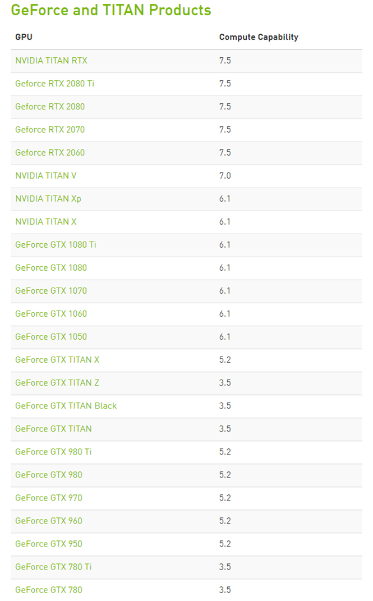

好了，下面我们正式进行GPU的安装。

**第一步，安装显卡驱动。**

在NVIDIA官网下载最新的显卡驱动 [https://www.geforce.cn/drivers]，例如我的GeForce RTX 2080，，操作系统请按照你自己的情况选择Windows 7 64-bit 或者 Windows10 64-bit。

**注意事项：TensorFlow 2 需要的 CUDA 10.1 ，需要 [NVIDIA® GPU 驱动程序](https://www.nvidia.com/drivers) 418.x 或更高版本。**

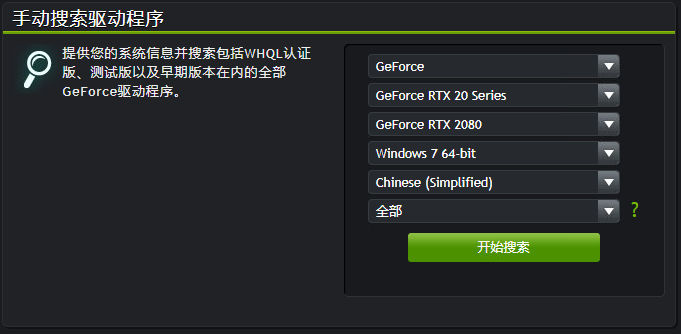

找到后点击下载：


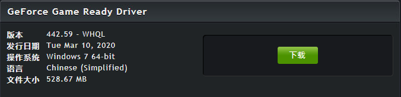

下载完成后，进行安装（这是RTX2080显卡对应的驱动程序，读者的硬件和驱动有可能不同）：


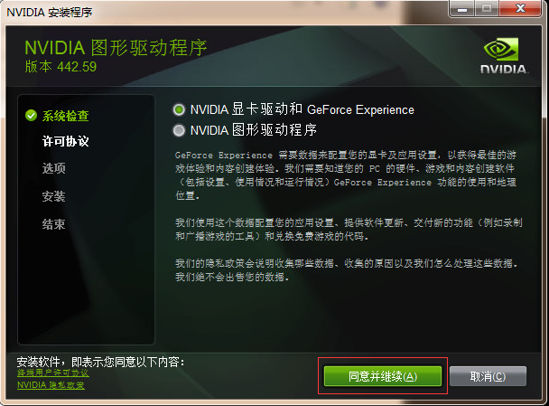

安装完成后，重启计算机：

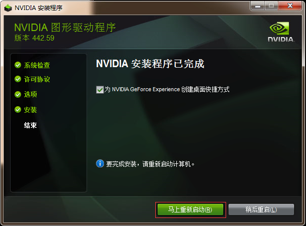

**第二步，安装CUDA工具包。**

TensorFlow 2 支持 CUDA 10.1（TensorFlow 2.1.0 及更高版本），我们可以在 [NVIDIA官网 https://developer.nvidia.com/cuda-downloads](https://developer.nvidia.com/cuda-downloads) 下载需要的 CUDA 工具包，这里选择 CUDA 10.1.243，下载地址为 https://developer.nvidia.com/cuda-10.1-download-archive-update2 ，然后选择对应操作系统的版本。

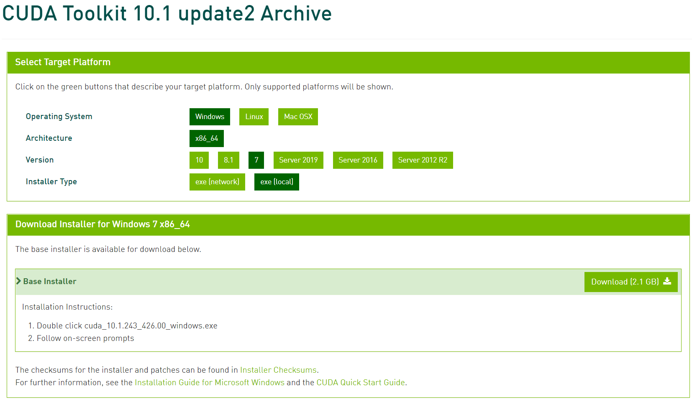

下载完成以后，正常进行安装即可。

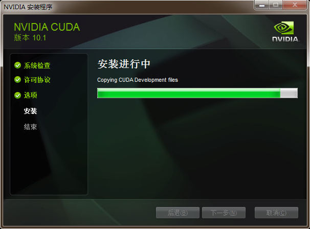

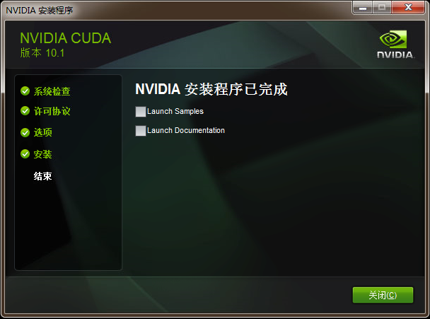


**第三步，安装cuDNN SDK。**

TensorFlow 2 支持 cuDNN SDK（7.6 及更高版本），我们可以在 [NVIDIA官网 https://developer.nvidia.com/cudnn](https://developer.nvidia.com/cudnn) 下载需要的 cuDNN SDK（下载时可能需要注册 NVIDIA 的账号），这里选择 cudnn 7.6.5 for cuda 10.1，下载地址为 https://developer.nvidia.com/rdp/cudnn-download ，然后选择对应操作系统的版本。

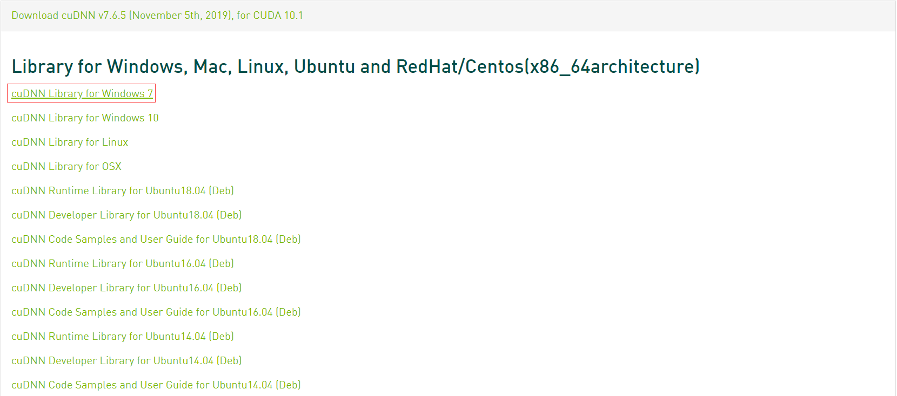

下载完成后，是一个压缩包，先解压缩：

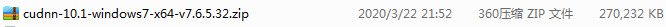

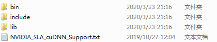

解压缩后的3个文件夹（ bin、include、lib ），直接拷贝至 CUDA 安装目录下的相同名称的对应文件夹中即可，CUDA （10.1版本为例）路径一般为：C:\Program Files\NVIDIA GPU Computing Toolkit\CUDA\v10.1，如下图所示：

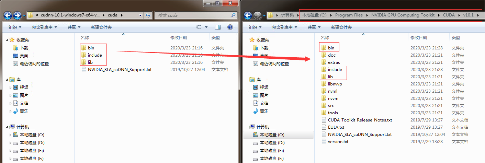

拷贝完成后，cuDNN的安装就完成了。

**第四步，确认系统的环境变量（正常情况下安装完成自动添加）**

① 确认 环境变量->系统变量->Path ，增加了下述2个路径：

C:\Program Files\NVIDIA GPU Computing Toolkit\CUDA\v10.1\bin;

C:\Program Files\NVIDIA GPU Computing Toolkit\CUDA\v10.1\libnvvp;

② 确认 环境变量->系统变量，增加了 CUDA_PATH 变量，变量值为：

C:\Program Files\NVIDIA GPU Computing Toolkit\CUDA\v10.1

③ 确认 环境变量->系统变量，增加了 CUDA_PATH_V10_1 变量，变量值为：

C:\Program Files\NVIDIA GPU Computing Toolkit\CUDA\v10.1

**第五步，新建项目（如果读者的 GPU 环境已经配置完成，可以跳过前面 1~3 步骤）**


**附：GPU安装经验技巧分享之 Anaconda 的 Python 环境 TensorFlow-GPU 自动安装**

接下来的内容演示了 Anaconda 的 Python 环境 TensorFlow-GPU 自动安装，**主要目的是可以通过 Anaconda 的自动配置功能，自动搜索到适合读者 GPU 硬件的 tensorflow-gpu 、 CUDA 和 cuDNN 的版本号**。

如果你不清楚适配你的机器的 CUDA 和 cuDNN 版本，可以在安装完最新的支持 TensorFlow 2 [ CUDA 10.1 ] 的 NVIDIA 显卡驱动以后，通过 Anaconda 软件进行自动安装剩剩余的 CUDA 和 cuDNN 。Anaconda 是一款集成了Python 解释器和虚拟环境等一系列辅助功能的软件，通过安装Anaconda 软件，可以同时获得Python 解释器，包管理，虚拟环境等一系列便捷功能，免去我们安装过程中的一些错误，降低不必要的学习成本。

你可以通过 Anaconda 的官方网站 https://www.anaconda.com/distribution/#download-section 进行下载，建议下载最新的含 Python 3.7 的 64位 Windows 版本。

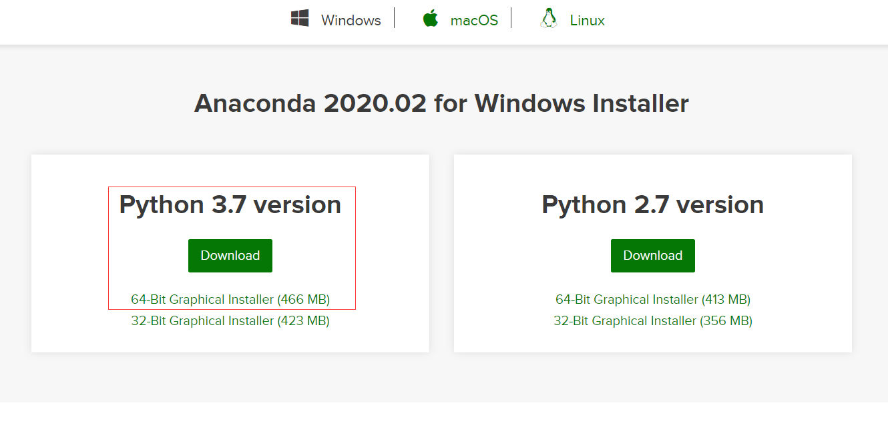

下载完成后，按照步骤进行安装即可，这里不再赘述。

安装完成后，按照下述步骤进行：

（ 注意：国内的读者可以通过修改下载源配置为清华源来提高下载速度，配置源的指令如下：

conda config --add channels https://mirrors.tuna.tsinghua.edu.cn/anaconda/pkgs/free/

conda config --add channels https://mirrors.tuna.tsinghua.edu.cn/anaconda/pkgs/main/

可以删除默认的源，通过打开用户文档路径下的 .condarc 文件，删除末尾的 -default 

并且建议升级 conda 为最新版本，升级的指令如下：

conda update conda ）

① 打开 开始菜单->Anaconda Prompt (Anaconda3)

② 输入指令，创建新的环境，**conda create --name tf2 python=3.7**

③ 切换到新创建的环境 tf2 ，**conda activate tf2**

④ 安装 tensorflow-gpu，**conda install tensorflow-gpu**

上一步的安装 tensorflow-gpu 的过程中，conda 会自动搜索并安装最新版本的 tensorflow-gpu ，同时自动搜索所有需要的配套库和环境并自动下载安装，非常便利。其中，我们可以重点查看到 CUDA 和 cuDNN 的版本号，对应本文中 GPU 硬件的版本号自动匹配为 cudatoolkit-10.1.243 和 cudnn-7.6.5-cuda10.1 ，如下所示：

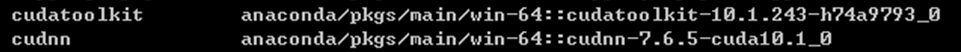

最新的 tensorflow-gpu 版本为  tensorflow-gpu-2.1.0 ，如下所示：

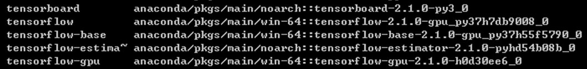

下载和安装可能需要等待 5~10 分钟，直到终端提示 done 代表全部正常安装完成。

⑤ 测试 tensorflow-gpu 是否正确安装

首先，打开 Anaconda 自带的 IDE Spyder ，修改 Python 解释器为 tf2 环境下的 python.exe ，如下所示：

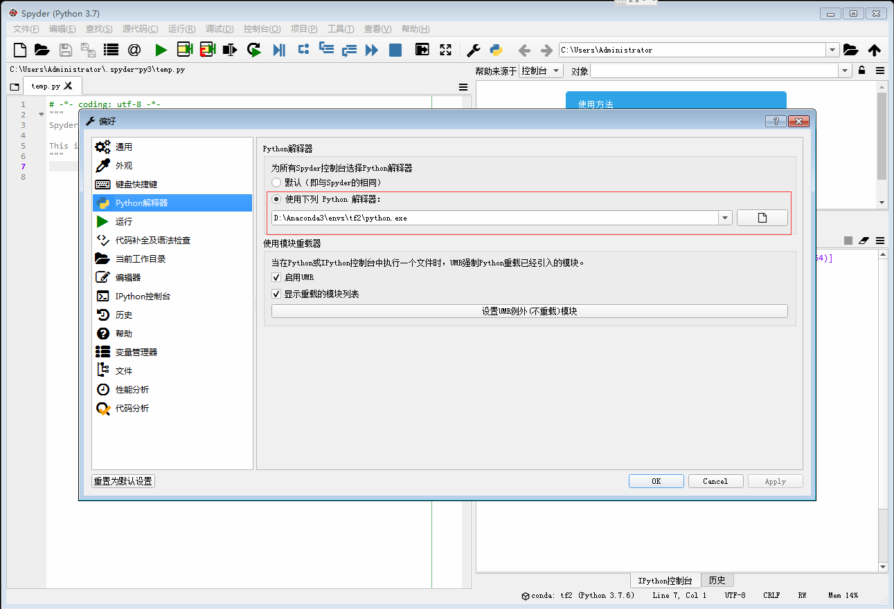

然后，新建文件，输入测试代码：

```python
import tensorflow as tf
print(tf.test.is_gpu_available())
print(tf.test.is_built_with_cuda())
```

如果程序正常输出了 True ，就代表 tensorflow-gpu 和 cuda 已经全部安装成功啦！

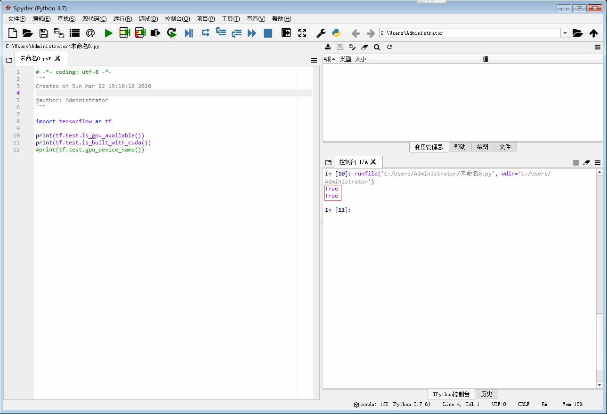


### 1.2 利用TF.NET识别MNIST数据集

### 1.3 利用TF.NET训练自己的数据集

### 1.4 TF.NET 进行工业现场部署和推理

