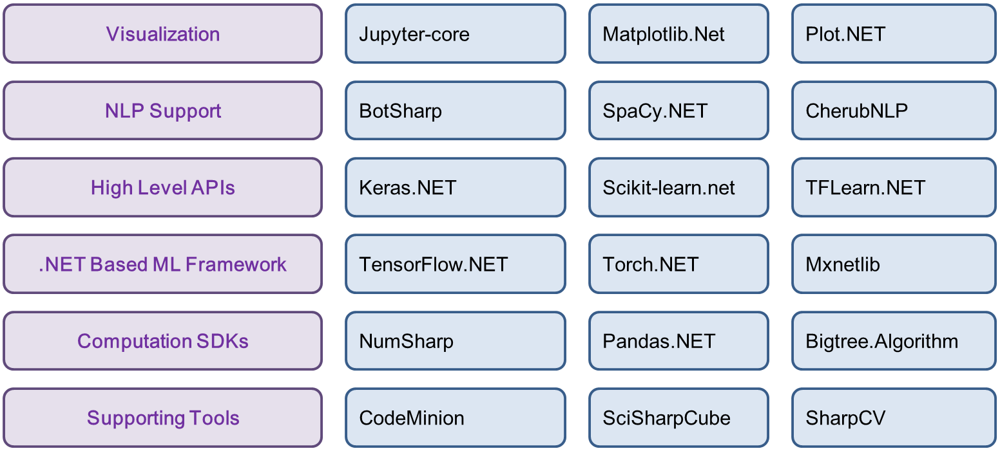
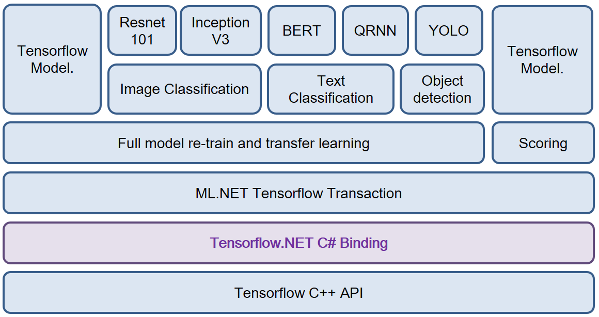
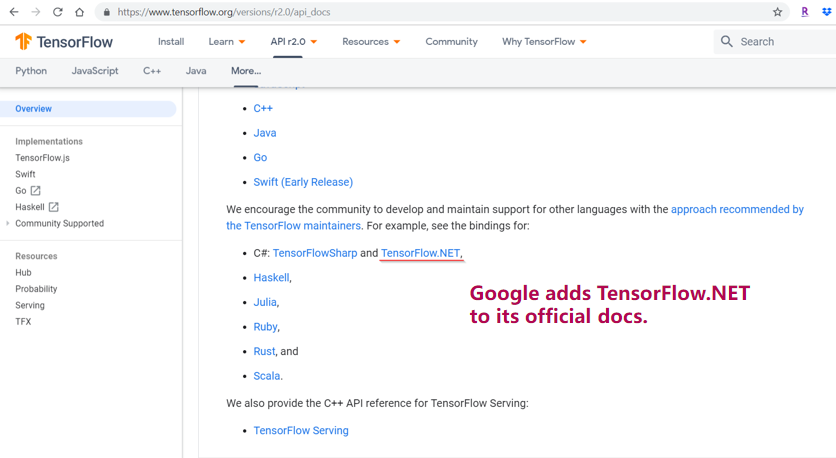

# C# TensorFlow 2 入门教程

# 二、TensorFlow.NET API

## 1. TensorFlow.NET介绍

[TensorFlow.NET](<https://github.com/SciSharp/TensorFlow.NET>) (TF.NET) 是 [SciSharp STACK](<https://github.com/SciSharp>)   开源社区团队的贡献，它为[TensorFlow](https://www.tensorflow.org/)提供了.NET Standard binding，旨在以C＃实现完整的Tensorflow API，允许.NET开发人员使用跨平台的.NET Standard框架开发、训练和部署机器学习模型。TF.NET的使命是打造一个完全属于.NET开发者自己的机器学习平台，**特别对于C#开发人员来说，是一个“0”学习成本的机器学习平台**，该平台集成了大量API和底层封装，**力图使TensorFlow的Python代码风格和编程习惯可以无缝移植到.NET平台**，下图是同样TF任务的Python实现和C#实现的语法相似度对比，从中读者基本可以略窥一二。

SciSharp STACK的机器学习工具库和微软官方的库最大的区别是：里面所有库的语法都最大限度的按照python生态的习惯。有了SciSharp, 相当于有了typed-python (强类型python)，这样做的目的，也是为了.NET开发者花最小的成本去学习并运用上机器学习。SciSharp STACK 目前包含几个流行项目: BotSharp(AI机器人平台框架)，NumSharp(数值计算库)，TensorFlow.NET (深度学习库)，Pandas.NET (数据处理库)，SharpCV（图形图像处理库），可以完全脱离Python环境使用，**目前已经被微软ML.NET官方的底层算法集成，并被谷歌写入TensorFlow官网教程推荐给全球开发者。**

- **SciSharp 产品结构**

  

- **微软 ML.NET底层集成算法**

  

- **谷歌官方推荐.NET开发者使用**

  URL: https://www.tensorflow.org/versions/r2.0/api_docs

  

