# [C# TensorFlow 2 入门教程](<https://github.com/SciSharp/TensorFlow.NET-Tutorials>)

# 二、TensorFlow.NET API

## 5. Eager Mode

### 5.1 Eager模式说明

Eager Mode 也叫做动态图模式，是TensorFlow 1.4之后版本中最重要的新特征之一，也是TensorFlow 2.0的主流写法。Eager模式是一个命令式（imperative）、运行定义式的编程形式，操作一旦从程序中调用便立即得以执行，而不再像之前那样，生成一个Tensor，通过sess.run()才能拿到值，这样使得TensorFlow的入门使用、研究和开发就更为直观。

TensorFlow 2种的动态图是优先模式，为默认开启状态，在计算时可以同时获得计算图和数值运算的结果，可以在调试的过程中实时打印出数据。

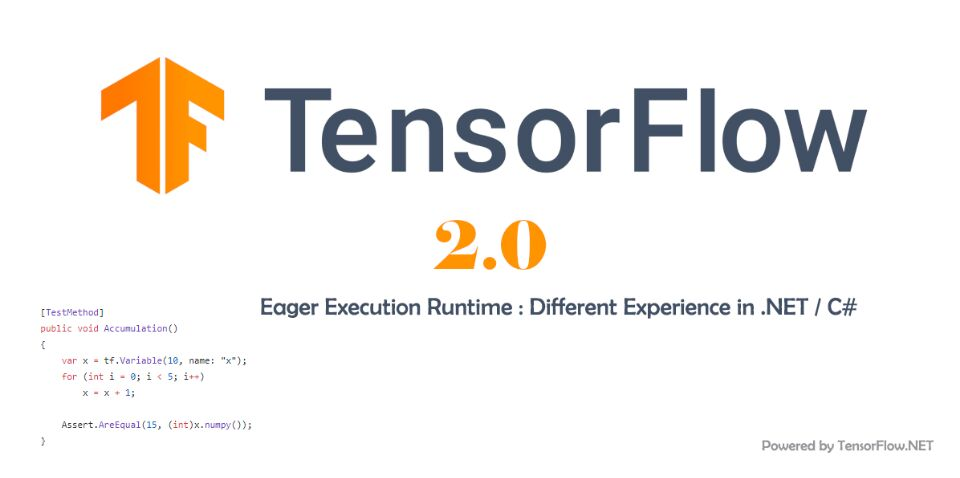

### 5.2 Eager模式比较

下面通过TF.NET的代码对比，方便读者直观了解TensorFlow 1.4之前的静态图和 TensorFlow 2 的Eager模式的差异点。

首先，我们在TensorFlow 1.x下实现 2.0 + 3.0 的简单加法运算。

第一步，创建计算图。

创建计算图的过程仅仅是使用各变量名创建出 “ a + b ” 加法的计算规则，记录下该公式的计算步骤，并没有传入具体的值和执行具体的计算过程。

第二步，赋值并运行计算图。

通过开启会话Session，运行公式(静态图)中的节点 “ c ”，并复制 a = 2.0 , b = 3.0 来获得 c 的数值计算结果。

完整代码如下：

```c#
using System;
using Tensorflow;
using static Tensorflow.Binding;

namespace TF_Test
{
    class Program
    {
        //Basic Operation 2.0 + 3.0 with TensorFlow.NET 1.x
        static void Main(string[] args)
        {
            // 1.创建计算图 
            // 创建2个输入端子，指定类型和名字 
            var a = tf.placeholder(tf.float32, name: "variable_a");
            var b = tf.placeholder(tf.float32, name: "variable_b");
            // 创建输出端子的运算操作，并命名 
            var c = tf.add(a, b, name: "variable_c");

            // 2. 赋值并运行计算图
            // 初始化运行环境，开启会话Session
            var init = tf.global_variables_initializer();
            using (var sess = tf.Session())
            {
                sess.run(init);//运行初始化操作，完成初始化
                //给输入端子赋值
                var feed_dict = new FeedItem[]
                {
                    new FeedItem(a, 2),
                    new FeedItem(b, 3)
                };
                //运行输出端子
                var c_numpy = sess.run(c, feed_dict);
                //运行完输出端子，得到数值类型的 c_numpy
                Console.WriteLine($"Addition with variables: {c_numpy}");
            }

            Console.Read();
        }
    }
}
```

可以看到，在 TensorFlow.NET 1.x 中完成简单的 2.0 + 3.0 的过程十分繁琐，后面搭建复制的神经网络模型亦是如此，这种先创建静态计算图再赋值执行的方式叫做符号式编程。

接下来，我们来看下在 TensorFlow.NET 2.0 中完成 2.0 + 3.0 运算的代码：

* TF.NET 也支持 使用 ( + , * , ... ) 等算术符直接进行运算

```c#
using System;
using Tensorflow;
using static Tensorflow.Binding;

namespace TF_Test
{
    class Program
    {
        //Basic Operation 2.0 + 3.0 with TensorFlow.NET 2
        static void Main(string[] args)
        {
            // 创建输入张量
            var a = tf.constant(2);
            var b = tf.constant(3);

            // 直接打印结果【也支持(+,*,...)等算术符直接进行运算】
            var c = tf.add(a, b);
            print($"Addition with variables: {c.numpy()}");
        }
    }
}
```

上述 2 种编程方式，都可以得到正确的结果 "Addition with variables: 5" 如下：

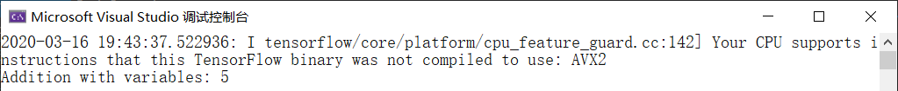

这种运算时同时创建计算图和计算结果的方式叫做命令式编程，TensorFlow 2 和 PyTorch 都是采用这种模式开发的，这种方式开发效率高，调试方便，所见即所得，但是运行效率可能不如静态图模式方便（后面我们会介绍如何使用 tf.function 来提高运行效率）。

### 5.3 Eager模式数值运算

现在，我们来演示 Eager Mode 下常见的 “ 加、减、乘、除 ” 数值运算，这串代码是通过 tf 函数 “ add、subtract、multiply、divide ”进行直接的数值运算，也可以通过运算符 “ +、-、*、/ ” 进行相同的数值操作。

常用的运算操作代码如下：

```c#
using System;
using Tensorflow;
using static Tensorflow.Binding;

namespace TF_Test
{
    class Program
    {
        //Basic Operation add,subtract,multiply,divide
        static void Main(string[] args)
        {
            // 定义Tensor常量类型的数值
            var a = tf.constant(2);
            var b = tf.constant(3);

            // 张量运算操作
            var add = tf.add(a, b);
            var sub = tf.subtract(a, b);
            var mul = tf.multiply(a, b);
            var div = tf.divide(a, b);

            // 访问运算结果并输出
            print("add =", add.numpy());//加
            print("sub =", sub.numpy());//减
            print("mul =", mul.numpy());//乘
            print("div =", div.numpy());//除    
        }
    }
}
```

代码的执行结果如下，我们可以看到 TF.NET 正确地执行并输出了运算后的数值：

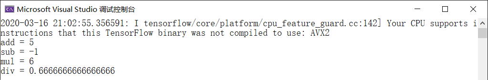

### 5.4 Eager模式张量降维运算

接下来，我们来演示 Eager Mode 下的 张量降维运算。

首先是模型训练过程中计算 Loss 时常用的 reduce_mean 和 reduce_sum 函数，从函数名称上可以看出来，这个函数有2个功能，降维和求平均(求和)。我们来分别讲解2个函数的定义：

tf.reduce_mean()：用于计算张量 tensor 沿着指定的数轴（tensor 的某一维度）上的平均值，主要用作降维或者计算 tensor（图像）的平均值。

```c#
public Tensor reduce_mean(
    Tensor[] input_tensors, 
    int? axis = null, 
    bool keepdims = false, 
    string name = null)
```

参数：

- input_tensors： 输入的待降维的 tensor
- axis： 指定的轴，如果不指定，则计算所有元素的均值
- keepdims：是否降维度，默认 false。设置为 true，输出的结果保持输入tensor 的形状，设置为 false，输出结果会降低维度
- name： 操作的名称

tf.reduce_sum()：用于计算张量 tensor 沿着指定的数轴（tensor 的某一维度）上的累加和，主要用作降维或者计算 tensor（图像）的累加和。

```c#
public Tensor reduce_sum(
    Tensor[] input_tensors, 
    int? axis = null, 
    bool keepdims = false, 
    string name = null)
```

参数：

- input_tensors： 输入的待降维的 tensor
- axis： 指定的轴，如果不指定，则计算所有元素的累加和
- keepdims：是否降维度，默认 false。设置为 true，输出的结果保持输入 tensor 的形状，设置为 false，输出结果会降低维度
- name： 操作的名称

除此之外，还有一些常用的函数，例如 reduce_any、reduce_all、reduce_prod、reduce_max、reduce_min ，这些都实现了降维和统计运算的功能。

这些函数的参数列表也是基本相同的，其中第一项 input_tensors 为待运算和待降维的输入张量；第二项 axis 为降维的轴，即需要对其进行降维的轴；第三项 keepdims 设定输出张量的维度是否保持和输入张量一致，一般选默认 false 以实现降维的效果，如果有特殊需要输出维度保持不变的情况，可以设定为 true ；最后一项 name 定义操作的名称。

上面的参数列表中，第二项 axis 可能需要读者进行一下理解，特别是维度超过2维的情况。当 axis = 0 时，是纵向对矩阵求和，原来矩阵有几列最后就得到几个值；相似地，当 axis = 1 时，是横向对矩阵求和，原来矩阵有几行最后就得到几个值；当省略 axis 参数时，默认对矩阵所有元素进行求和，最后得到一个值。如下图所示：

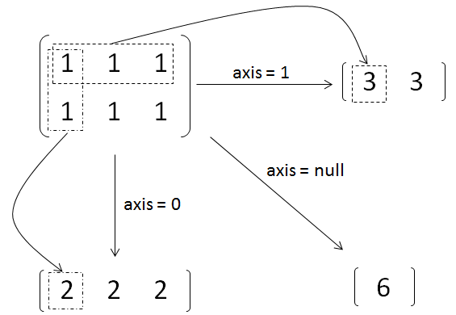

 对于一个多维的 array，最外层的括号里的元素的 axis 为 0，然后每减一层括号，axis 就加 1，直到最后的元素为单个数字。我们来按照3维的情况进行举例说明，例如 matrix = [[[1,2],[3,4]], [[5,6],[7,8]]]：

- axis=0时，所包含的元素有：[[1, 2],[3, 4]]、[[5, 6],[7, 8]]
- axis=1时，所包含的元素有：[1, 2]、[3, 4]、[5, 6]、[7, 8]
- axis=2时，所包含的的元素有：1、2、3、4、5、6、7、8

当 axis = 0，reduce_sum() 得到的结果应为 [[6 , 8], [10 , 12]]，即把两个矩阵对应位置元素相加；当 axis = 1，reduce_sum() 得到的结果应为 [[ 4 , 6], [12 , 14]]，即把数组对应元素相加。一句话总结就是对哪一维操作，计算完后外面的括号就去掉，相当于降维。

TF.NET 的 tf.reduce_mean 和 tf.reduce_sum 代码测试如下：

```c#
using NumSharp;
using System;
using Tensorflow;
using static Tensorflow.Binding;

namespace TF_Test
{
    class Program
    {
        //Basic Operation tf.reduce_mean,tf.reduce_sum
        static void Main(string[] args)
        {
            // 定义Tensor常量
            var a = tf.constant(2);
            var b = tf.constant(3);
            var c = tf.constant(5);

            // tf.reduce_mean 和 tf.reduce_sum 运算
            var mean = tf.reduce_mean(new[] { a, b, c });
            var sum = tf.reduce_sum(new[] { a, b, c });

            // 访问运算结果并输出
            print("mean =", mean.numpy());
            print("sum =", sum.numpy());
        }
    }
}
```

运行后，程序正确地输出了张量平均值与累加和的结果 3 和 10，如下所示：

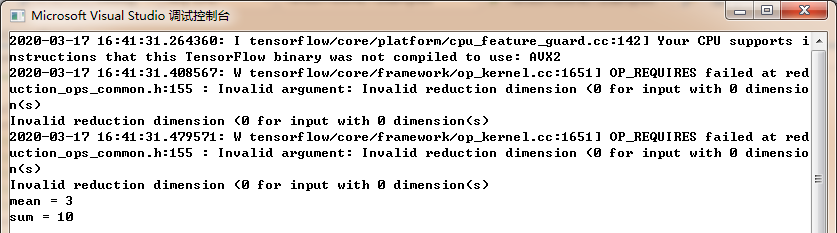

### 5.5 Eager模式矩阵运算

最后，简单介绍一下Eager模式的矩阵运算，矩阵运算有 tf.diag()、tf.matmul()、tf.batch_matmul()等，这里主要说明下矩阵乘法 tf.matmul()。

矩阵乘法的运算公式是这样的，设 **A** 为 m × p 的矩阵， **B** 为 p × n 的矩阵，那么称 m × n 的矩阵 **C** 为矩阵 **A** 与 **B** 的乘积，记作 C = A B ，其中矩阵 **C** 中的第 i 行第 j 列元素可以表示为：

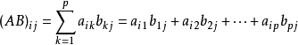

如下所示：

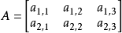

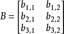

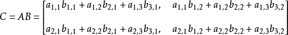

简单地说，矩阵乘法就是矩阵A和矩阵B的行列交叉相乘并累加求和，求和的结果生成新的矩阵，如下图所示：

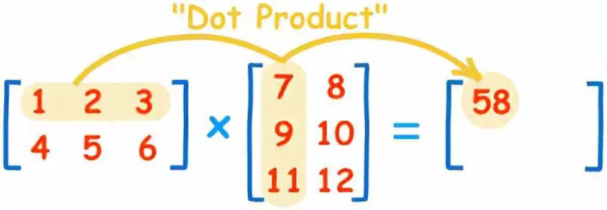

下面我们通过实际案例来说明，2个二维矩阵的乘法，我们先看一下公式：

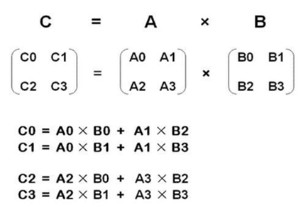

然后我们通过代码实现一下2个二维矩阵的乘法，代码如下：

```c#
using NumSharp;
using System;
using Tensorflow;
using static Tensorflow.Binding;

namespace TF.Test
{
    class Program
    {
        static void Main(string[] args)
        {
            // 矩阵乘法
            var matrix1 = tf.constant(np.array(new float[,] { { 1, 2 }, { 3, 4 } }));
            var matrix2 = tf.constant(np.array(new float[,] { { 5, 6 }, { 7, 8 } }));
            var product = tf.matmul(matrix1, matrix2);
            // 类型转换：tensor转换成numpy
            print("product =", product.numpy());
        }
    }
}
```

通过代码调试我们可以看到 product 是一个 sharp 为[2,2] 的张量，各矩阵的形状如下：

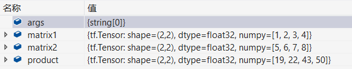

程序运行后正确地输出了矩阵相乘的结果转换成的 numpy 类型数值为 [19, 22, 43, 50]：

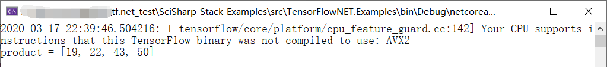


